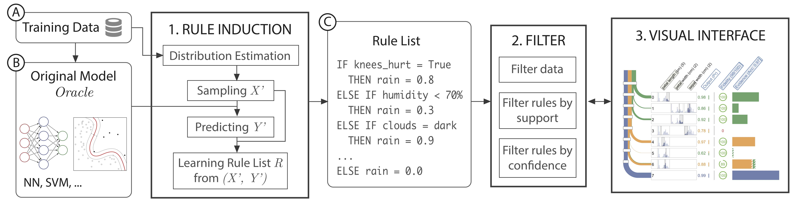

# Introduction

RuleMatrix is an interactive visualization that helps you understand the input-output behavior of a classifier. RuleMatrix treat a given classifier as a black-box, and create a explanatory visual interface using rule induction and visual analytics.

# How it works?

RuleMatrix adopt a three-step pipeline to create a explanatory visual interface.

**STEP 1** Rule Induction

**STEP 2** Filtering

**STEP 3** Visualization

# Visual Encoding

The core feature of RuleMatrix is the comprehensive interactive visualization.

The visualization consists of three parts: 
